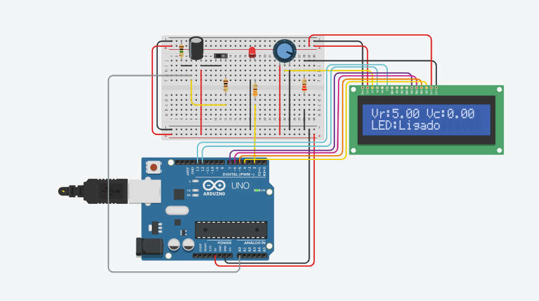
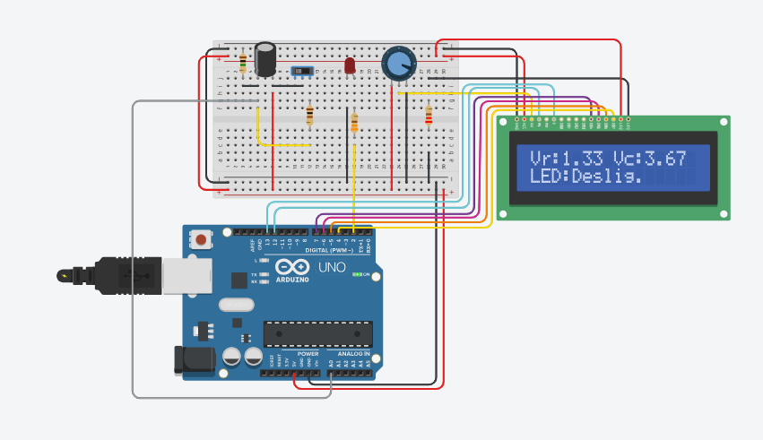
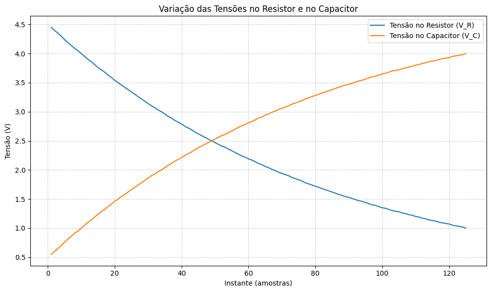

# Aula 2 - Circuito RC

A quarta aula do módulo teve como foco o estudo e a aplicação prática do circuito RC(Resistor-Capacitor), utilizado para eliminar ruídos e falsos acionamentos causados em botões mecânicos.

Durante a aula, foi montado um circuito utilizando um resistor, um capacitor, um botão de pressão, um LED e um display LCD conectados à placa Arduino. O circuito RC atuou como um filtro, garantindo que o sinal do botão fosse limpo e estável.

Com isso, ao pressionar o botão, o LED é ligado ou desligado alternadamente, e o display LCD exibe o estado atual, mostrando se o LED está ligado ou desligado.

Abaixo estão o código utilizado no projeto e as imagens de demonstração do circuito em funcionamento, e da variação de tensão nos componentes (resistor e capacitor) comprovando a eficácia do circuito RC na eliminação de ruídos e no controle preciso do LED.

```C++
#include <LiquidCrystal.h>

LiquidCrystal lcd(12, 13, 7, 6, 5, 4);

int pinoNoRC = A0;   
int ledPin = 2;      


int valorLido = 0;
float tensaoCapacitor = 0, tensaoResistor = 0;
unsigned long tempo;
bool ledLigado = false;

void setup() { 
  Serial.begin(9600); 
  pinMode(ledPin, OUTPUT);

  // Inicializa o LCD
  lcd.begin(16, 2); 
  lcd.setCursor(0, 0);
  lcd.print("Iniciando...");
  delay(1000);
  lcd.clear();
} 

void loop() { 
  tempo = millis(); 
  valorLido = analogRead(pinoNoRC); 
  
  tensaoResistor = (valorLido * 5.0 / 1023.0); 
  tensaoCapacitor = abs(5.0 - tensaoResistor);

  if (tensaoCapacitor < 2.5) {  
    ledLigado = true;
    digitalWrite(ledPin, HIGH);
  } else {
    ledLigado = false;
    digitalWrite(ledPin, LOW);
  }

  Serial.print(tempo);
  Serial.print(" ");
  Serial.print(tensaoResistor);
  Serial.print(" ");
  Serial.println(tensaoCapacitor);

  lcd.clear();
  lcd.setCursor(0, 0);
  lcd.print("Vr:");
  lcd.print(tensaoResistor, 2);
  lcd.print(" Vc:");
  lcd.print(tensaoCapacitor, 2);

  lcd.setCursor(0, 1);
  lcd.print("LED:");
  lcd.print(ledLigado ? "Ligado " : "Deslig.");

  delay(100); 
}

```
 <div align="center">
    <sub>Imagem 1: Ilustração LED ligado</sub><br>
    <br>
    <sup> Ilustração resistor carregado</sup>
     </div>

 <div align="center">
    <sub>Imagem 2: Ilustração LED desligado</sub><br>
    <br>
    <sup>Ilustração resistor descarregado</sup>
     </div>

 <div align="center">
    <sub>Imagem 3: Gráfico tensão no Capacitor e Resistor</sub><br>
    <br>
    <sup>Ilustração variação de tensão</sup>
     </div>

Link da aplicação: https://www.tinkercad.com/things/j9J1A8n1m0x-cool-krunk-wluff