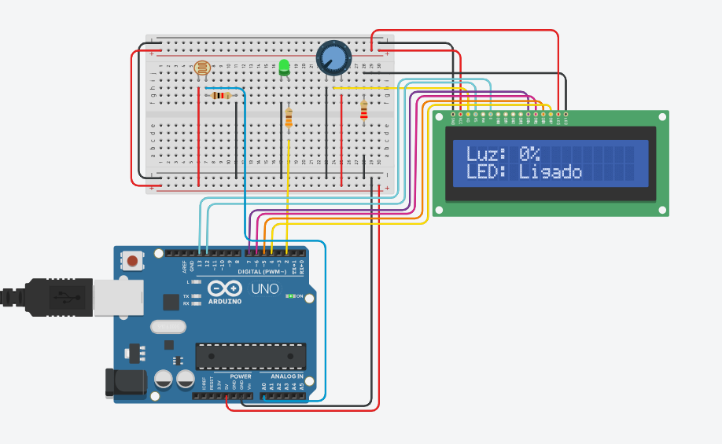
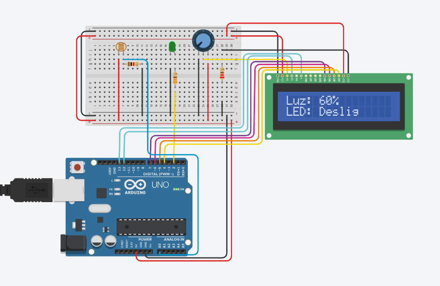

## Aula 3 - Programação Orientada a Objetos

A terceira aula do módulo teve como objetivo explorar a programação na linguagem C++, dedicando-se ao aprofundadamento da Programação Orientada a Objetos. Sendo assim, como atividade de fixação foi desenvolvendo um projeto, uilizando os conceitos de POO. 

O sistema em questão funcioa por meio de um sensor LDR, que mede a intensidade luminosa do ambiente e acende ou apaga um LED, de acordo com essa medição. Aaplicação também contempla um display LCD, que mostra tanto a intensidade luminosa medida, quanto o estado do LED. 

Abaixo segue o código utilizado no desenvolvimento dessa aplicação e as imagens de demostração. 

```C++
#include <LiquidCrystal.h>


LiquidCrystal lcd(12, 13, 7, 6, 5, 4); 


const int LDR_PIN = A0;  
const int LED_PIN = 2;   


class SensorLuz;
class LedIndicador;


class DisplayLCD {
  private:
    LiquidCrystal* lcd;
  public:
    DisplayLCD(LiquidCrystal& display) {
      lcd = &display;
      lcd->begin(16,2);
      lcd->clear();
    }

    void atualizar(SensorLuz& sensor, LedIndicador& led);
};


class SensorLuz {
  private:
    int pinoLDR;
    int valorLido;
  public:
    SensorLuz(int pin) {
      pinoLDR = pin;
      valorLido = 0;
      pinMode(pinoLDR, INPUT);
    }

    void atualizar() {
      valorLido = analogRead(pinoLDR);
    }

    int getValor() {
      return valorLido;
    }

    int getPorcentagem() {
      return map(valorLido, 0, 1023, 0, 100);
    }
};


class LedIndicador {
  private:
    int pinoLED;
    bool ligado;
  public:
    LedIndicador(int pin) {
      pinoLED = pin;
      ligado = false;
      pinMode(pinoLED, OUTPUT);
      desligar();
    }

    void ligar() {
      digitalWrite(pinoLED, HIGH);
      ligado = true;
    }

    void desligar() {
      digitalWrite(pinoLED, LOW);
      ligado = false;
    }

    bool estaLigado() {
      return ligado;
    }
};


void DisplayLCD::atualizar(SensorLuz& sensor, LedIndicador& led) {
  lcd->setCursor(0,0);
  lcd->print("Luz: ");
  lcd->print(sensor.getPorcentagem());
  lcd->print("%   "); 

  lcd->setCursor(0,1);
  lcd->print("LED: ");
  lcd->print(led.estaLigado() ? "Ligado " : "Deslig");
}


SensorLuz ldr(LDR_PIN);
LedIndicador led(LED_PIN);
DisplayLCD display(lcd);


const int LIMIAR = 500;

void setup() {
  Serial.begin(115200);
  Serial.println("Sistema de Luz iniciado!");
}

void loop() {
  ldr.atualizar();

  
  if (ldr.getValor() < LIMIAR) {
    led.ligar();
  } else {
    led.desligar();
  }

  
  display.atualizar(ldr, led);

  delay(200);
}

```
 <div align="center">
    <sub>Imagem 1: LED ligado</sub><br>
    <br>
    <sup>Ilustração LED ligado</sup>
     </div>

 <div align="center">
    <sub>Imagem 1: LED desligado</sub><br>
    <br>
    <sup>Ilustração LED desligado</sup>
     </div>

Link da aplicação: https://www.tinkercad.com/things/jqlj6uoAGa9-fantastic-bombul-wluff